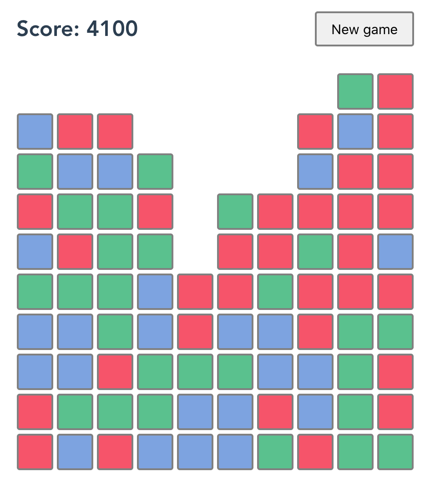

[](https://lgtm.com/projects/g/slaweet/vuejs-cube-crash/alerts/)
[](https://lgtm.com/projects/g/slaweet/vuejs-cube-crash/context:javascript)
[](https://david-dm.org/slaweet/vuejs-cube-crash)
[](https://david-dm.org/slaweet/vuejs-cube-crash?type=dev)
[](https://github.com/airbnb/javascript "AirBnB Style guide")
[](https://opensource.org/licenses/MIT)

# vuejs-cube-crash

Cube crash game written in Vue.js. Just for fun 🎉




## Project setup
```
yarn install
```

### Compiles and hot-reloads for development
```
yarn serve
```

### Compiles and minifies for production
```
yarn build
```

### Run your unit tests
```
yarn test:unit
```

### Lints and fixes files
```
yarn lint
```

### Customize configuration
See [Configuration Reference](https://cli.vuejs.org/config/).
